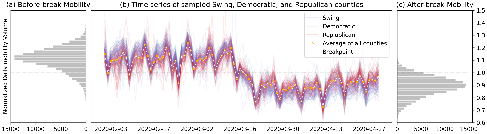

# The Association between Partisanship and Human Mobility Change during the First Wave of the COVID-19 Pandemic in the United States

- First-phase result of the **Socioeconomic Impact on Human Mobility** project
- Accepted by LBS 2023 Conference

**Abstract**

Researchers usually divide counties into the Democratic and the Republican in analyzing human mobility during the COVID-19 pandemic in the US. However, the Swing counties remain a blind spot. Our study reveals that the Swing counties highly resemble the Democratic, but considerably differ from the Republican with respect to the change in mobility volume. People living in the Swing and the Democratic counties consistently reduced traveling during the first wave. Towards the end of it, residents in the Republican counties started increasing traveling. In 2748 out of 3101 counties, the abrupt drop took place on the same day, March 16th, 3 days before the first stay-at-home order. Our findings highlight the role of political affiliation in shaping people’s travel behavior and demonstrate the lag in public health policy.

Left: Histograms of the daily mobility volumes of all counties (a) over the entire study period, (b) before the breakpoint, (c) after the breakpoint. Right: (d) Time series of sampled Democratic and Republican counties.
